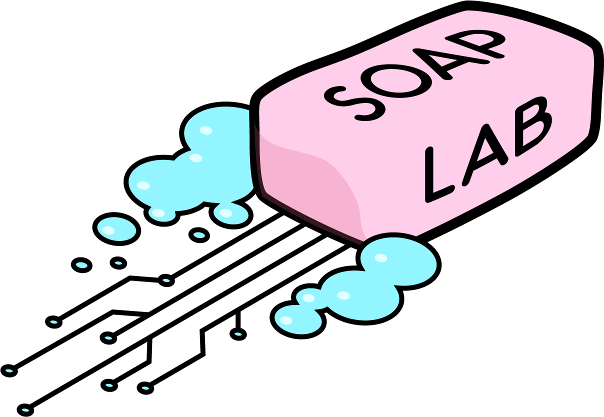

# SOAP Lab

Welcome to SOAP Lab, the official project repository for the 2020 Imperial iGEM team!

We are created a start to end pipeline for generating liquid handler scripts based on a genetic design. The backend can be found in the **DJANGO-Assembly-Methods** repository and the frontend in the **igem_frontend** repository. Additionally, our introduction to modelling documents and code guidance can be found in the **Intro-to-Modelling-Code** repository.

Check it out at [soaplab.io](https://www.soaplab.io)  and make some designs!

You can also check out our documentation [here](https://imperial-igem.github.io/DJANGO-Assembly-Methods/)!
